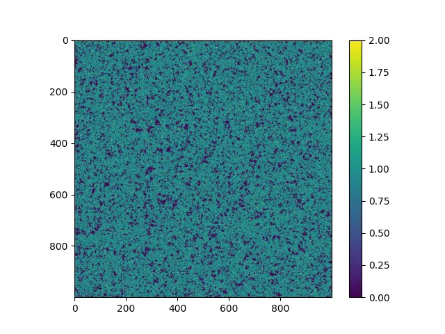

# Poisson Icing 🐟❄️

Poisson Icing is a Python package which does Gibbs sampling on the Poisson-Ising
model. The Poisson-Ising model is a 2D image of Poisson distributed random
variables but has a dependency on their four neighbours. This causes the Poisson
random variables to be similar (or dissimilar) to their neighbours.

This package is designed to run on the GPU (using CUDA and CuPy) but also has a
slower CPU version.

## How to Install

Requires:

* `nvidia-cuda-toolkit`
* `build-essential`

Git clone the repository or download from releases.

Inside the directory, compile the CUDA code into a `.ptx` file by calling `make`
and providing compute capability. For example, for an NVIDIA A100 GPU

```bash
make NVCC_ARCH=sm_80
```

where `sm_80` is the compute capability. **Please see the [CUDA GPU compilation
documentation](https://docs.nvidia.com/cuda/cuda-compiler-driver-nvcc/#gpu-feature-list)
to find the compute capability for your GPU.** For example:

* An *Nvidia Tesla V100* has a Volta architecture with code `sm_70`.
* An *Nvidia GeForce GTX 1660* has a Turing architecture with code `sm_75`.
* An *Nvidia A100* has an Ampere architecture with code `sm_80`.
* An *Nvidia H100* has an Ampere architecture with code `sm_90`.

Install the Python package *inside a [virtual
environment](https://docs.python.org/3/library/venv.html)*. This is done by
activating a virtual environment and running `pip install`s. For CUDA 11, they
are

```bash
pip install .
pip install .[cuda11x]
```

If you use CUDA 12, replace the last line with `pip install .[cuda12x]` instead.

### How to Install - CPU Only

If you only require the CPU implementation, the above instructions can be
simplified to just

```bash
pip install .
```

### Troubleshooting

If you find the above installation instructions do not work, please see below.

#### Compute Capability

When compiling the CUDA code into a `.ptx`, the compute capability must be
provided. **Please see the [CUDA GPU compilation
documentation](https://docs.nvidia.com/cuda/cuda-compiler-driver-nvcc/#gpu-feature-list)
to find the compute capability for your GPU.**

It might help to delete `src/poissonicing.ptx` if you wish to recompile it.

If you do not wish to use the `Makefile`, the following command may be used
instead

```bash
nvcc -ptx src/poissonicing.cu -o src/poissonicing.ptx \\
  -arch=$(NVCC_ARCH) -L$(CUDA_HOME)/lib64 -lcudart
```

where `$(NVCC_ARCH)` is the compute capability, eg `sm_80`.

#### CuPy Version

The version of CuPy must be compatible with your CUDA version. See the [CuPy
installation guide](https://docs.cupy.dev/en/stable/install.html) to see the
available versions of CuPy.

Ensure you use, correctly, either `pip install .[cuda11x]` or `pip install
.[cuda12x]` in the instructions above. You may also, instead, install CuPy
yourself.

#### Apptainer Definition File

An Apptainer definition file `poisson_icing.def` and
`poisson_icing_cpu_only.def` is provided should you wish to build this library
in a container or use it to further troubleshoot.

## Examples

### GPU



To define the model, the following were provided:

* The Poisson rate for each pixel in the image `rate_param`
* The interation term which is constant `interaction`

To request how many samples to take, the following were provided:

* The number of saved samples `n_sample`
* The thinning parameter `n_thin`

To initalise the sampling, the following were provided:

* The initial image to start sampling from `initial_image`. This contains random
  Poisson samples.
* A `cupy` random number generator

Lastly, the block dimension for the GPU is needed. This is a tuning parameter
which affects the performance of the code. Block dimensions of 32&times;2,
64&times;1, 8&times;8 are good starting points.

```python
import cupy
import matplotlib.pyplot as plt
import numpy as np
from numpy import random

import poisson_icing.gpu


def main():
    width = 1000
    height = 1000
    rng = random.default_rng(267388082994302295440407913531899274874)
    rng_gpu = cupy.random.default_rng(65364652167924712153197736465669859297)

    rate_param = np.ones((height, width))
    interaction = 0.8
    n_sample = 1
    n_thin = 100

    block_dim = (32, 2)

    initial_image = rng.poisson(rate_param)

    image_array = poisson_icing.gpu.sample(
        rate_param,
        interaction,
        n_sample,
        n_thin,
        initial_image,
        rng_gpu,
        block_dim,
    )

    plt.figure()
    plt.imshow(image_array[0], vmax=2)
    plt.colorbar()
    plt.show()
    plt.close()


if __name__ == "__main__":
    main()
```

### CPU


To define the model, the following were provided:

* The Poisson rate for each pixel in the image `rate_param`
* The interation term which is constant `interaction`

To request how many samples to take, the following were provided:

* The number of saved samples `n_sample`
* The thinning parameter `n_thin`

To initalise the sampling, the following were provided:

* The initial image to start sampling from `initial_image`. This contains random
  Poisson samples.
* A `numpy` random number generator

```python
import matplotlib.pyplot as plt
import numpy as np
from numpy import random

import poisson_icing.cpu


def main():
    width = 200
    height = 200
    rng = random.default_rng(267388082994302295440407913531899274874)

    rate_param = np.ones((height, width))
    interaction = 0.8
    n_sample = 1
    n_thin = 100

    initial_image = rng.poisson(rate_param)

    image_array = poisson_icing.cpu.sample(
        rate_param, interaction, n_sample, n_thin, initial_image, rng
    )

    plt.figure()
    plt.imshow(image_array[0])
    plt.colorbar()
    plt.show()
    plt.close()


if __name__ == "__main__":
    main()
```
